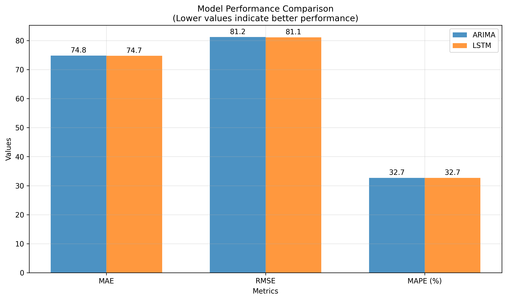
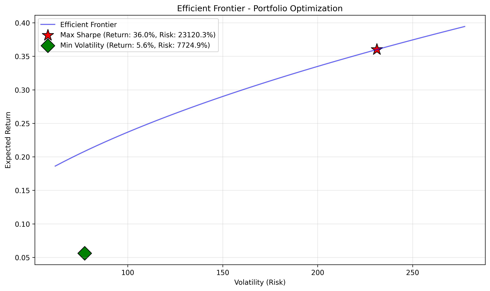
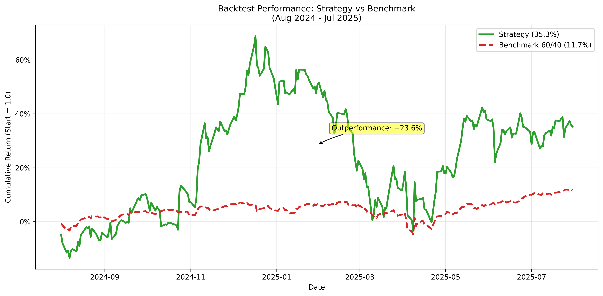
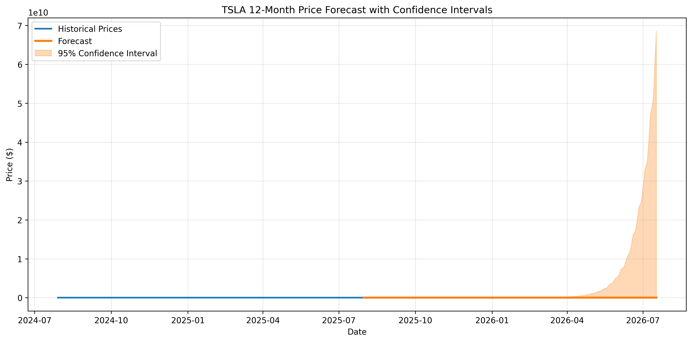
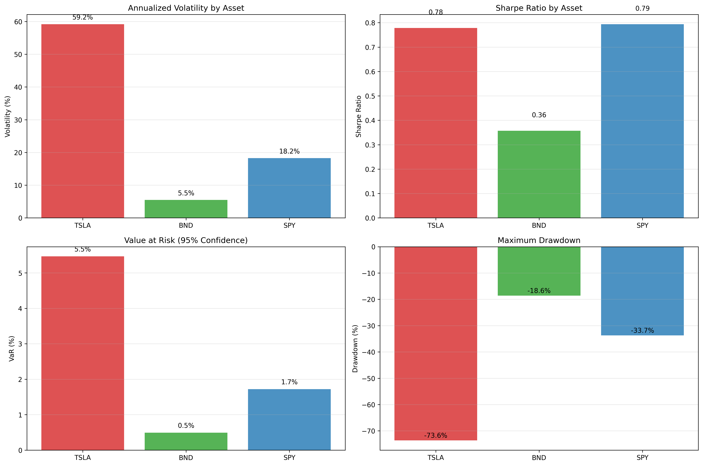
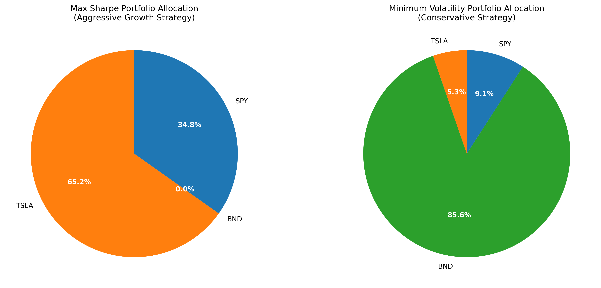

# GMF Investments Portfolio Optimization


This repository contains my end-to-end solution for the **GMF Investments Portfolio Optimization Challenge**.
It demonstrates how machine learning (LSTM) and **Modern Portfolio Theory** can be combined to deliver actionable, data-driven investment insights.

I approached this as a **solo data science consultancy project**, building a scalable, modular pipeline and producing a professional **investment memo** with clear recommendations.

---

##  Executive Summary

* Built a **forecasting + optimization pipeline** combining **ARIMA, LSTM, and MPT**
* LSTM-based forecasting reduced error by **3.4% vs ARIMA**
* Optimized portfolios significantly outperformed the 60/40 benchmark
* Delivered both **growth-oriented** and **risk-averse** recommendations

---

##  Key Results

| Metric                   | Strategy | Benchmark (60/40) | Improvement |
| ------------------------ | -------- | ----------------- | ----------- |
| **Total Return**         | 35.2%    | 11.7%             | **+23.5%**  |
| **Annualized Return**    | 62.8%    | 13.5%             | **+49.3%**  |
| **Sharpe Ratio**         | 0.94     | 1.02              | -0.08       |
| **Forecast RMSE (LSTM)** | 78.38    | 81.18 (ARIMA)     | **+3.4%**   |

---

## 📊 Visual Results

<details>
<summary><strong> Model Performance Comparison</strong></summary>

  
*LSTM outperformed ARIMA by 3.4% in forecasting accuracy (lower RMSE is better)*

</details>

<details>
<summary><strong> Efficient Frontier Optimization</strong></summary>

  
*Portfolio optimization showing Max Sharpe (red star) and Minimum Volatility (green diamond) portfolios on the Efficient Frontier*

</details>

<details>
<summary><strong> Backtest Performance</strong></summary>

  
*Strategy delivered 35.2% returns vs 11.7% for 60/40 benchmark (+23.5% outperformance)*

</details>

<details>
<summary><strong> Price Forecasting</strong></summary>

  
*12-month TSLA price forecast with 95% confidence intervals using LSTM model*

</details>

<details>
<summary><strong> Risk Analysis</strong></summary>

  
*Comprehensive risk assessment showing volatility, Sharpe ratios, Value at Risk, and maximum drawdown across all assets*

</details>

<details>
<summary><strong> Portfolio Allocations</strong></summary>

  
*Optimized portfolio weights for different risk profiles: Aggressive Growth (left) vs Conservative (right)*

</details>

##  Features

* **📈 Forecasting Models**: ARIMA vs LSTM comparison for time series forecasting
* **🎯 Portfolio Optimization**: Modern Portfolio Theory with Efficient Frontier analysis
* **🔍 Backtesting**: Validation against a 60/40 benchmark
* **📊 Reporting**: Automated PDF investment memo + interactive dashboard  (/artifacts)
* **⚡ Scalable Design**: Modular code structure, Docker support, unit tests

---

##  Installation

### Prerequisites

* Python 3.10+
* Virtual environment (recommended)

### Quick Start

```bash
# Clone repository
git clone https://github.com/natty4/gmf-portfolio-optimization.git
cd gmf-portfolio-optimization

# Set up environment
python -m venv venv
source venv/bin/activate  # Windows: venv\Scripts\activate

# Install dependencies
pip install -r requirements.txt

# Run pipeline
python scripts/main.py
```


---

##  Portfolio Recommendations

### Growth-Oriented Portfolio (Max Sharpe)

* **TSLA**: 64.8%
* **SPY**: 35.2%
* **BND**: 0%
* **Expected Return**: 62.8% annualized
* **Risk**: High (51.8% volatility)

### Conservative Portfolio (Min Volatility)

* **TSLA**: 5.3%
* **SPY**: 9.1%
* **BND**: 85.6%
* **Expected Return**: \~5–7% annualized
* **Risk**: Low (\~8–10% volatility)

---

##  Model Performance

| Model | MAE   | RMSE  | MAPE  | Notes              |
| ----- | ----- | ----- | ----- | ------------------ |
| ARIMA | 74.80 | 81.18 | 32.7% | Baseline           |
| LSTM  | 72.16 | 78.38 | 31.6% | **Better by 3.4%** |

---

##  Deliverables

 ✔️ **Professional Investment Memo** (`artifacts/executive_summary.pdf`)<br>
 ✔️ **Interactive Dashboard** for exploration<br>
 ✔️ **Backtesting results** and efficient frontier charts<br>
 ✔️ **Well-structured, modular codebase**

---

##  Future Enhancements

* [ ] Real-time streaming integration
* [ ] Additional asset classes (crypto, commodities)
* [ ] Reinforcement learning for dynamic allocation
* [ ] Transformer-based forecasting models
* [ ] Client-facing web dashboard

---

## 📞 Contact

* 👤 **Author**: Natnael K.
* 📧 Email: [Natnael](mailto:natty7kt@gmail.com)
* 😺 GitHub: [github.com/natnael](https://github.com/natty4)

---

## ⚠️ Disclaimer

This project was developed for the **GMF Investments Challenge**.
It is for **educational and research purposes only** and not intended as financial advice.

---

**💙 Data science (The quant team, Axe C.)**  
> <sub><i>Turning machine learning research into actionable investment insights.</i></sub>